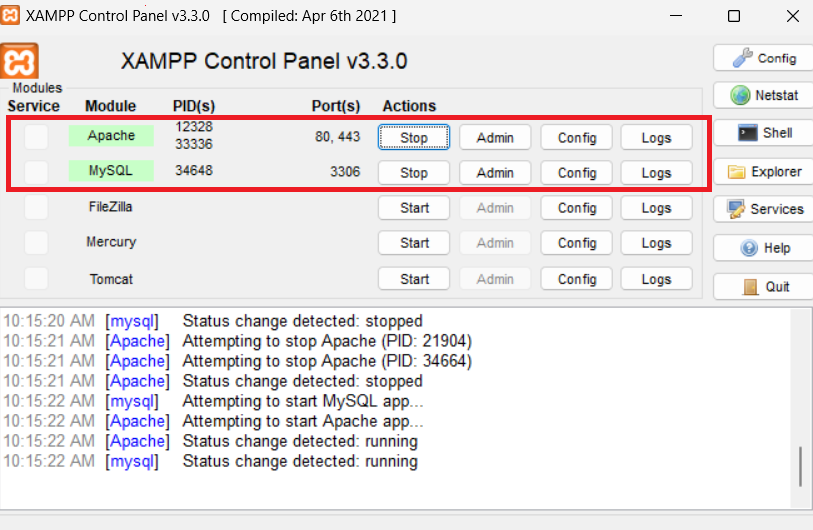
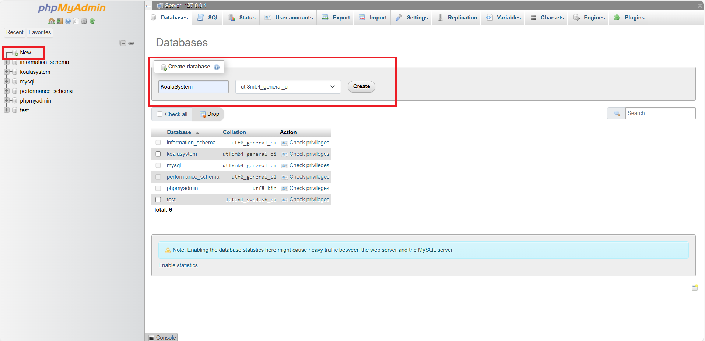

# Lachlan's Automatic PHP Object to SQL (LAPOS)
This is a quickstart guide to use the LAPOS framework for this assignment. LAPOS allows you to build objects as PHP classes, and without writing any SQL, tables will be built, objects can be saved to sql and updated (currently no deleting). 
## Constraints:
There are a couple key constraints/limitations to the system:
- all objects will have their primary key be an int column called `id`
- all foriegn key references can only link to the primairy key ID of another object.
- all strings have a 512 character max and are stored as VARHCAR(512); this will be improved at some point soon
- Only the following datatypes are supported:

    | PHP      | SQL          |
    |----------|--------------|
    | String   | VARCHAR(512) |
    | INTEGER  | INTEGER      |
    | FLOAT    | FLOAT        |
    | BOOLEAN  | BOOLEAN      |
    | DATETIME | DATETIME     |

## Examples
check out reservation.php for a well documented example on how to setup an object
## The `sql` object
the sql object is what is used to interact with SQL. Create an instance of it, if it successfully connects then you can use these.
- getObjects(string $class, string $WhereClause = "") 
    - $class: input the class followed by `::Class()`, (eg `Customer::Class()`) 
    - $WhereClause: pass in a where statement to filter the request eg `WHERE id = 5`, this is standard SQL where statements.
    - This function allows you to pass a class into it, with a WHERE statement to filter the request. It fetches all objects based on your WHERE statement, forms them into PHP objects and returns an array of them. So  `$sql->getobjects(Customer::Class(),"WHERE id = 5")` will return an array with one entry, the customer with an id of 5.
- buildTableFromObject(string $object)
    - input the class followed by `::Class()`, (eg `Customer::Class()`) 
    - this only needs to be run once, it builds the table for the class based on what you define inside the PHP class. 
- saveObject(sqlObject $object)
    - $object: input an instance of a sqlObject that you want to save to the database
    - Saves a sqlObject to SQL, if it has an ID already, it will try to update the record with that ID, if there is no ID set in the object, it will insert a new record with the data, and give the sqlObject the ID of the new record.
# Setup
Please ensure you are using Xampp. (*You can configure MySQL and Appache manually but it's more work and I am not sure how to do it myself lol*). To start Xampp open the control pannel and turn on Appache and MySql. To ensure they are on, the ports should be listed that they are running on. (see image below)

## SQL setup
- Go to PHPMyAdmin <a href="http://localhost/phpmyadmin/">here</a>

- Press new and enter database name. I called mine `KoalaSystem`, however you can name it anything, just take note
- one created, open the project and open the folder `core/config`. 
- DUPLICATE `sqlconfig.php.TEMPLATE`. Remove the `.TEMPLATE`, and save the file. (**NOTE DO NOT simply rename the original file; as that will cause git issues.**)
- Change the configuration details to match what you have setup, however the username, password and localhost will most likely be the same unless you have changed them. 
## Ensure proper setup
- go to <a href="http://localhost/test.php"> test.php</a> to ensure everything is configured. If all green you should be good to go :)
- For an example of how to create objects, look at `/core/objects/reservation.php`
